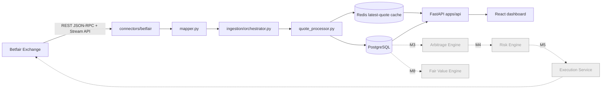

# Architecture — Milestones 0-1

## 1. Repo tree (target for M0/M1; later milestones add implementation, not new top-level shape)

```text
marketedge/
├── README.md
├── pyproject.toml
├── docker-compose.yml
├── .env.example
├── Makefile
├── docs/
│   ├── architecture.md
│   ├── venue-matrix.md
│   ├── strategy-spec.md
│   ├── STATUS.md
│   ├── runbooks/
│   │   ├── exchange-outage.md
│   │   ├── partial-fill.md
│   │   └── kill-switch.md
│   └── adr/
│       ├── 001-canonical-market-model.md
│       ├── 002-arb-first.md
│       └── 003-execution-isolation.md
├── apps/
│   ├── api/                      # FastAPI gateway — routing + DTOs only
│   │   ├── main.py
│   │   ├── dependencies.py
│   │   └── routes/
│   │       ├── venues.py
│   │       ├── events.py
│   │       ├── markets.py
│   │       ├── opportunities.py  # stub — Milestone 3
│   │       ├── orders.py         # stub — Milestone 5
│   │       ├── portfolio.py      # stub — Milestone 7
│   │       └── settings.py
│   └── web/                      # React + TypeScript dashboard shell
│       ├── package.json
│       └── src/
│           ├── pages/
│           ├── components/
│           ├── hooks/
│           ├── api/
│           └── types/
├── marketedge/                    # core domain — vendor-neutral, importable without any connector
│   ├── config/
│   │   ├── settings.py
│   │   └── venue_rules.py
│   ├── domain/
│   │   ├── enums.py
│   │   ├── models.py
│   │   ├── money.py
│   │   ├── odds.py
│   │   └── errors.py
│   ├── connectors/
│   │   ├── base.py               # MarketDataConnector / ExecutionConnector protocols
│   │   └── betfair/
│   │       ├── client.py         # certlogin + JSON-RPC betting API
│   │       ├── stream.py         # Exchange Stream API (TLS socket)
│   │       ├── mapper.py         # vendor payload -> canonical DTOs
│   │       └── execution.py      # stub, execution_allowed gated off by default
│   ├── ingestion/
│   │   ├── orchestrator.py
│   │   ├── quote_processor.py
│   │   └── heartbeat.py
│   ├── matching/                 # Milestone 2 — event/market/selection matching
│   ├── pricing/                  # Milestone 2/8 — de-vig, consensus, CLV
│   ├── strategies/
│   │   ├── base.py
│   │   ├── arbitrage/            # Milestone 3
│   │   ├── value/                # Milestone 8
│   │   └── exchange/             # Milestone 10
│   ├── risk/                     # Milestone 4
│   ├── execution/                # Milestone 5
│   ├── portfolio/                # Milestone 6/7
│   ├── analytics/                # Milestone 7
│   ├── storage/
│   │   ├── db.py
│   │   ├── repositories/
│   │   └── migrations/           # Alembic
│   └── observability/
│       ├── logging.py
│       └── metrics.py
├── tests/
│   ├── unit/
│   ├── integration/
│   ├── contract/
│   ├── replay/
│   └── fixtures/
└── scripts/
```

**Agent rule (unchanged from spec):** vendor-specific fields never leak into
`marketedge/domain`, `marketedge/strategies`, `marketedge/risk`, or
`marketedge/pricing`. Only `marketedge/connectors/<venue>/` may import a
vendor SDK or reference vendor field names. Directories for milestones not
yet built (`matching/`, `pricing/`, `strategies/value/`, `risk/`,
`execution/`, `portfolio/`, `analytics/`) exist as placeholders with a
single stub module so the shape in section 6 of the spec is preserved from
M0 onward, without pre-building unimplemented logic.

## 2. Component diagram (M0/M1 scope highlighted)



Only the solid path (Betfair connector → mapper → orchestrator → Redis/Postgres
→ API → web) is implemented in M0/M1. Everything marked `future` is an empty
package with a stub module, wired in later milestones per the spec's
milestone sequence (section 28) and validation gates (section 44).

## 3. Database ERD (M0/M1: full schema from spec section 8 is created now,
since it is defined independently of milestone number; only `quotes` is
populated with live data in M1 — `opportunities`, `orders`, `fills`, and
`signal_evaluations` are created empty, ready for Milestones 3/5/7)

```mermaid
erDiagram
    VENUES ||--o{ VENDOR_EVENTS : "sources"
    VENUES ||--o{ QUOTES : "quotes"
    VENUES ||--o{ ORDERS : "orders"
    EVENTS ||--o{ VENDOR_EVENTS : "maps to"
    EVENTS ||--o{ MARKETS : "has"
    MARKETS ||--o{ SELECTIONS : "has"
    SELECTIONS ||--o{ QUOTES : "priced by"
    SELECTIONS ||--o{ ORDERS : "traded"
    OPPORTUNITIES ||--o{ ORDERS : "generates"
    OPPORTUNITIES ||--|| SIGNAL_EVALUATIONS : "evaluated by"
    ORDERS ||--o{ FILLS : "fills"
    EVENTS ||--o{ OPPORTUNITIES : "concerns"
    MARKETS ||--o{ OPPORTUNITIES : "concerns"

    VENUES {
        bigint id PK
        text code
        text name
        bool data_allowed
        bool execution_allowed
        text geo_status
        text terms_status
        timestamptz checked_at
        text evidence_url
    }
    EVENTS {
        uuid id PK
        text sport
        text competition
        timestamptz start_time
        text home_participant
        text away_participant
        text status
    }
    VENDOR_EVENTS {
        bigint venue_id FK
        text vendor_event_id
        uuid canonical_event_id FK
        text raw_name
        timestamptz start_time
        numeric match_confidence
    }
    MARKETS {
        uuid id PK
        uuid event_id FK
        text market_type
        text period
        numeric line
        text settlement_scope
    }
    SELECTIONS {
        uuid id PK
        uuid market_id FK
        text outcome_key
        text display_name
    }
    QUOTES {
        bigint id PK
        bigint venue_id FK
        uuid selection_id FK
        text side
        numeric price
        numeric available_size
        timestamptz source_timestamp
        timestamptz received_at
        bool is_live
        jsonb raw_payload
    }
    OPPORTUNITIES {
        uuid id PK
        text strategy
        uuid event_id FK
        uuid market_id FK
        timestamptz detected_at
        timestamptz expires_at
        numeric expected_profit
        numeric expected_roi
        numeric worst_case_profit
        numeric confidence
        text status
        jsonb snapshot
    }
    ORDERS {
        uuid id PK
        bigint venue_id FK
        uuid opportunity_id FK
        text client_order_id
        text vendor_order_id
        uuid selection_id FK
        text side
        numeric requested_price
        numeric requested_size
        numeric matched_size
        numeric average_matched_price
        text state
    }
    FILLS {
        bigint id PK
        uuid order_id FK
        numeric price
        numeric size
        timestamptz filled_at
        text vendor_fill_id
    }
    SIGNAL_EVALUATIONS {
        uuid opportunity_id PK_FK
        numeric taken_price
        numeric fair_price_at_signal
        numeric reference_price_t60
        numeric reference_price_t10
        numeric closing_price
        numeric clv
        numeric expected_value
        numeric realised_pnl
        timestamptz settled_at
    }
```

## 4. Domain model interfaces (M1)

See `marketedge/domain/models.py`, `marketedge/domain/enums.py`, and
`marketedge/connectors/base.py` for the authoritative definitions. Summary:

- `CanonicalEvent`, `CanonicalMarket`, `CanonicalSelection` — frozen
  dataclasses, vendor-neutral, matching spec section 7.1 exactly.
- `Quote` — frozen dataclass carrying both `received_at_utc` and
  `source_timestamp_utc` for latency measurement (spec 7.2 / 10.2).
- `VenueCapability` — `data_allowed` / `execution_allowed` gate consumed by
  `marketedge/config/venue_rules.py`; the execution layer refuses to
  initialise when `execution_allowed=False` (spec 7.3 / 24).
- `MarketDataConnector` / `ExecutionConnector` — `typing.Protocol`s in
  `marketedge/connectors/base.py`, matching spec section 9 exactly. Strategy
  and API code depend only on these protocols, never on `betfair.*` types.

## 5. Assumptions / questions deferred past M0-M1

These do not block Milestone 0/1 and are intentionally left open:

1. **Betfair Stream API subscription scope.** M1 subscribes to
   `marketSubscription` with `EX_BEST_OFFERS` ladder depth for whatever
   markets `list_events`/`list_markets` discover for the configured sports
   in `.env`/`marketedge/config/settings.py` (`SPORTS_ENABLED`, defaults to
   football + tennis per spec section 30, but the connector itself queries
   `listEventTypes` dynamically rather than hard-coding IDs — spec M1 exit
   criteria). Multi-sport *discovery* scheduling/budgeting is Milestone 2.
2. **No bookmaker odds feed yet.** `marketedge/connectors/odds_provider/`
   is not created until Milestone 2; M1 has exactly one connector
   (Betfair), so market *matching* (`marketedge/matching/`) has nothing to
   join against yet and stays a stub.
3. **Certificate provisioning.** Betfair certificate login requires a
   self-signed or CA client certificate uploaded to the bettor's Betfair
   account outside this codebase. `.env.example` documents the expected
   paths; no cert is generated or committed here.
4. **Execution stays off.** `connectors/betfair/execution.py` exists as an
   interface-shaped stub only; `BETFAIR_EXECUTION_ALLOWED` defaults to
   `false` and there is no code path that can flip it at runtime (Milestone
   5 concern).
5. **Retention/partitioning.** `quotes` is not yet partitioned by date
   (spec 10.3/8.3 note); acceptable at M1 data volumes, revisit once
   continuous ingestion has run for weeks.
6. **Auth on the API.** Spec section 25 requires auth + audit trail on all
   mutating endpoints. M1 has no mutating endpoints yet (opportunities/
   orders/portfolio routers are stubs returning `501`), so API auth
   middleware is deferred to Milestone 4-5 alongside the risk engine.
7. **CI does not run live Betfair calls.** Contract tests replay sanitised
   fixture payloads (`tests/fixtures/betfair_*.json`); nothing in CI
   requires real credentials.
