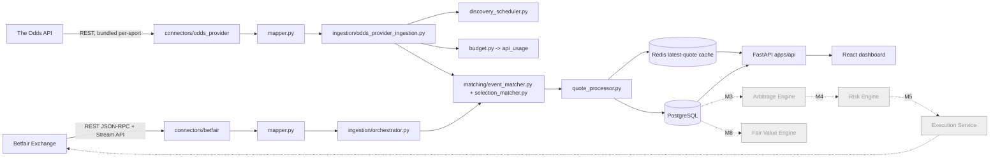

# Architecture — Milestones 0-2

## 1. Repo tree (target shape from M0; later milestones mostly add implementation to existing packages, not new top-level shape)

```text
marketedge/
├── README.md
├── pyproject.toml
├── docker-compose.yml
├── .env.example
├── Makefile
├── docs/
│   ├── architecture.md
│   ├── venue-matrix.md
│   ├── strategy-spec.md
│   ├── STATUS.md
│   ├── runbooks/
│   │   ├── exchange-outage.md
│   │   ├── partial-fill.md
│   │   └── kill-switch.md
│   └── adr/
│       ├── 001-canonical-market-model.md
│       ├── 002-arb-first.md
│       └── 003-execution-isolation.md
├── apps/
│   ├── api/                      # FastAPI gateway — routing + DTOs only
│   │   ├── main.py
│   │   ├── dependencies.py
│   │   └── routes/
│   │       ├── venues.py
│   │       ├── events.py
│   │       ├── markets.py
│   │       ├── opportunities.py  # stub — Milestone 3
│   │       ├── orders.py         # stub — Milestone 5
│   │       ├── portfolio.py      # stub — Milestone 7
│   │       └── settings.py
│   └── web/                      # React + TypeScript dashboard shell
│       ├── package.json
│       └── src/
│           ├── pages/
│           ├── components/
│           ├── hooks/
│           ├── api/
│           └── types/
├── marketedge/                    # core domain — vendor-neutral, importable without any connector
│   ├── config/
│   │   ├── settings.py
│   │   └── venue_rules.py
│   ├── domain/
│   │   ├── enums.py
│   │   ├── models.py
│   │   ├── money.py
│   │   ├── odds.py
│   │   └── errors.py
│   ├── connectors/
│   │   ├── base.py               # MarketDataConnector / ExecutionConnector protocols
│   │   ├── drafts.py             # EventDraft/MarketDraft/RunnerDraft/QuoteDraft — shared by every mapper
│   │   ├── betfair/
│   │   │   ├── client.py         # certlogin + JSON-RPC betting API
│   │   │   ├── stream.py         # Exchange Stream API (TLS socket)
│   │   │   ├── mapper.py         # vendor payload -> canonical DTOs
│   │   │   └── execution.py      # stub, execution_allowed gated off by default
│   │   └── odds_provider/        # Milestone 2 — The Odds API (bookmaker prices)
│   │       ├── client.py         # REST client + x-requests-* credit accounting
│   │       └── mapper.py         # bundled per-sport response -> canonical DTOs
│   ├── ingestion/
│   │   ├── orchestrator.py           # Betfair discover/stream/poll + runs both loops
│   │   ├── odds_provider_ingestion.py # Milestone 2 — adaptive per-sport discovery loop
│   │   ├── discovery_scheduler.py    # Milestone 2 — spec §41.3 polling buckets
│   │   ├── budget.py                 # Milestone 2 — spec §41.2/41.6 credit ledger
│   │   ├── quote_processor.py
│   │   └── heartbeat.py
│   ├── matching/                 # Milestone 2 — event/market/selection matching
│   │   ├── aliases.py            # pure fuzzy name normalisation (no I/O)
│   │   ├── alias_resolver.py     # DB-backed alias-table override layer
│   │   ├── confidence.py         # spec §11.3 event-match scoring formula
│   │   ├── event_matcher.py      # AUTO_MATCH / REVIEW / NO_MATCH decision
│   │   └── selection_matcher.py  # HOME/AWAY/DRAW/OVER/UNDER outcome_key assignment
│   ├── pricing/                  # Milestone 8 — de-vig, consensus, CLV
│   ├── strategies/
│   │   ├── base.py
│   │   ├── arbitrage/            # Milestone 3
│   │   ├── value/                # Milestone 8
│   │   └── exchange/             # Milestone 10
│   ├── risk/                     # Milestone 4
│   ├── execution/                # Milestone 5
│   ├── portfolio/                # Milestone 6/7
│   ├── analytics/                # Milestone 7
│   ├── storage/
│   │   ├── db.py
│   │   ├── orm.py
│   │   ├── repositories/         # incl. api_usage.py, aliases.py (Milestone 2)
│   │   └── migrations/           # Alembic
│   └── observability/
│       ├── logging.py
│       └── metrics.py
├── tests/
│   ├── unit/
│   ├── integration/
│   ├── contract/
│   ├── replay/
│   └── fixtures/
└── scripts/
    └── seed_aliases.py           # Milestone 2 — bootstrap participant_aliases rows
```

**Agent rule (unchanged from spec):** vendor-specific fields never leak into
`marketedge/domain`, `marketedge/strategies`, `marketedge/risk`, or
`marketedge/pricing`. Only `marketedge/connectors/<venue>/` may import a
vendor SDK or reference vendor field names — `marketedge/matching/` is not
an exception: `event_matcher.py`/`confidence.py`/`selection_matcher.py`
operate only on `MatchCandidate`/canonical field names, never on a raw
Betfair or Odds API payload. Directories for milestones not yet built
(`pricing/`, `strategies/value/`, `risk/`, `execution/`, `portfolio/`,
`analytics/`) still exist as placeholders with a single stub module so the
shape in section 6 of the spec is preserved, without pre-building
unimplemented logic.

## 2. Component diagram (M0-M2 scope highlighted)



The solid path is implemented through M2: two connectors, each mapping into
shared `connectors/drafts.py` DTOs, converging through `matching/` so a
Betfair event and an odds-provider event for the same fixture join onto one
canonical event/market/selection before quotes are persisted. Everything
marked `future` is still an empty package with a stub module, wired in
later milestones per the spec's milestone sequence (section 28) and
validation gates (section 44).

## 3. Database ERD (full schema from spec section 8 was created at M0/M1,
since it is defined independently of milestone number; M2 adds `api_usage`
and `participant_aliases`, spec sections 41.2 and 11.2. `opportunities`,
`orders`, `fills`, and `signal_evaluations` remain empty, ready for
Milestones 3/5/7)

```mermaid
erDiagram
    VENUES ||--o{ VENDOR_EVENTS : "sources"
    VENUES ||--o{ QUOTES : "quotes"
    VENUES ||--o{ ORDERS : "orders"
    EVENTS ||--o{ VENDOR_EVENTS : "maps to"
    EVENTS ||--o{ MARKETS : "has"
    MARKETS ||--o{ SELECTIONS : "has"
    SELECTIONS ||--o{ QUOTES : "priced by"
    SELECTIONS ||--o{ ORDERS : "traded"
    OPPORTUNITIES ||--o{ ORDERS : "generates"
    OPPORTUNITIES ||--|| SIGNAL_EVALUATIONS : "evaluated by"
    ORDERS ||--o{ FILLS : "fills"
    EVENTS ||--o{ OPPORTUNITIES : "concerns"
    MARKETS ||--o{ OPPORTUNITIES : "concerns"

    VENUES {
        bigint id PK
        text code
        text name
        bool data_allowed
        bool execution_allowed
        text geo_status
        text terms_status
        timestamptz checked_at
        text evidence_url
    }
    EVENTS {
        uuid id PK
        text sport
        text competition
        timestamptz start_time
        text home_participant
        text away_participant
        text status
    }
    VENDOR_EVENTS {
        bigint venue_id FK
        text vendor_event_id
        uuid canonical_event_id FK
        text raw_name
        timestamptz start_time
        numeric match_confidence
    }
    MARKETS {
        uuid id PK
        uuid event_id FK
        text market_type
        text period
        numeric line
        text settlement_scope
    }
    SELECTIONS {
        uuid id PK
        uuid market_id FK
        text outcome_key
        text display_name
    }
    QUOTES {
        bigint id PK
        bigint venue_id FK
        uuid selection_id FK
        text side
        numeric price
        numeric available_size
        timestamptz source_timestamp
        timestamptz received_at
        bool is_live
        jsonb raw_payload
    }
    OPPORTUNITIES {
        uuid id PK
        text strategy
        uuid event_id FK
        uuid market_id FK
        timestamptz detected_at
        timestamptz expires_at
        numeric expected_profit
        numeric expected_roi
        numeric worst_case_profit
        numeric confidence
        text status
        jsonb snapshot
    }
    ORDERS {
        uuid id PK
        bigint venue_id FK
        uuid opportunity_id FK
        text client_order_id
        text vendor_order_id
        uuid selection_id FK
        text side
        numeric requested_price
        numeric requested_size
        numeric matched_size
        numeric average_matched_price
        text state
    }
    FILLS {
        bigint id PK
        uuid order_id FK
        numeric price
        numeric size
        timestamptz filled_at
        text vendor_fill_id
    }
    SIGNAL_EVALUATIONS {
        uuid opportunity_id PK_FK
        numeric taken_price
        numeric fair_price_at_signal
        numeric reference_price_t60
        numeric reference_price_t10
        numeric closing_price
        numeric clv
        numeric expected_value
        numeric realised_pnl
        timestamptz settled_at
    }
    API_USAGE {
        bigint id PK
        text provider
        text endpoint
        text sport_key
        text market_keys
        text regions
        timestamptz requested_at
        bigint credits_used
        bigint remaining_credits_reported
        bigint response_status
        bigint response_latency_ms
    }
    PARTICIPANT_ALIASES {
        bigint id PK
        text sport
        text raw_name
        text canonical_key
    }
```

`API_USAGE` and `PARTICIPANT_ALIASES` have no foreign keys into the rest of
the schema — they're standalone operational tables (spec sections 41.2 and
11.2 respectively), not part of the event/market/quote graph.

## 4. Domain model interfaces (M1-M2)

See `marketedge/domain/models.py`, `marketedge/domain/enums.py`, and
`marketedge/connectors/base.py` for the authoritative definitions. Summary:

- `CanonicalEvent`, `CanonicalMarket`, `CanonicalSelection` — frozen
  dataclasses, vendor-neutral, matching spec section 7.1 exactly.
- `Quote` — frozen dataclass carrying both `received_at_utc` and
  `source_timestamp_utc` for latency measurement (spec 7.2 / 10.2).
- `VenueCapability` — `data_allowed` / `execution_allowed` gate consumed by
  `marketedge/config/venue_rules.py`; the execution layer refuses to
  initialise when `execution_allowed=False` (spec 7.3 / 24).
- `MarketDataConnector` / `ExecutionConnector` — `typing.Protocol`s in
  `marketedge/connectors/base.py`, matching spec section 9 exactly. Strategy
  and API code depend only on these protocols, never on `betfair.*` types.
  Note `OddsProviderConnector` deliberately does **not** implement
  `MarketDataConnector` — see §6 below.
- `MatchCandidate` (`marketedge/matching/confidence.py`) — the minimal
  vendor-neutral shape event matching needs (sport/competition/start
  time/participants), decoupled from both `EventDraft` and the `Event` ORM
  row so the pure scoring functions don't depend on either.
- `MatchResult` / `MatchDecision` (`marketedge/matching/event_matcher.py`)
  — `AUTO_MATCH` (score ≥ 0.98) / `REVIEW` (0.90-0.98) / `NO_MATCH` (< 0.90),
  spec section 11.3's gates exactly.

## 5. Adaptations from the spec's abstract shape (Milestone 2)

The spec's `MarketDataConnector` protocol (list_events → list_markets →
get_quotes/stream_quotes) is modelled on exchange-style APIs like
Betfair's. The Odds API returns an entire sport's events, bookmakers,
markets and prices in **one** bundled call — forcing that through the same
three/four-call waterfall per event would multiply metered API credit
usage for no benefit, directly undermining the budget-accounting goal this
same milestone introduces (spec section 41.2). `OddsProviderConnector`
therefore exposes its own two-method interface (`list_sports`,
`get_sport_snapshot`) and is driven by a separate ingestion loop
(`marketedge/ingestion/odds_provider_ingestion.py`) rather than
`orchestrator.py`'s generic `discover()`. Both loops converge on the same
`marketedge.matching` + `QuoteProcessor` + storage layer, so this is a
difference in *how discovery is fetched*, not in what gets persisted or
how cross-venue matching works.

Similarly, the spec's per-sport/per-market polling policy (section 41.3)
is implemented per-sport only (`discovery_scheduler.py`) — again because
one API call already refreshes every market for every event in that sport,
so there is no separate "market" axis to schedule independently for this
provider.

## 6. Assumptions / questions deferred past M0-M2

1. **Certificate provisioning.** Betfair certificate login requires a
   self-signed or CA client certificate uploaded to the bettor's Betfair
   account outside this codebase. `.env.example` documents the expected
   paths; no cert is generated or committed here.
2. **Execution stays off.** `connectors/betfair/execution.py` exists as an
   interface-shaped stub only; `BETFAIR_EXECUTION_ALLOWED` defaults to
   `false` and there is no code path that can flip it at runtime (Milestone
   5 concern). The odds provider has no execution surface at all — spec
   section 2 keeps bookmaker-side execution manual, permanently.
3. **Retention/partitioning.** `quotes` is not yet partitioned by date
   (spec 10.3/8.3 note); acceptable at current data volumes, revisit once
   continuous ingestion has run for weeks.
4. **Auth on the API.** Spec section 25 requires auth + audit trail on all
   mutating endpoints. Through M2 there are still no mutating endpoints
   (opportunities/orders/portfolio routers are stubs returning `501`), so
   API auth middleware is deferred to Milestone 4-5 alongside the risk
   engine.
5. **CI does not run live Betfair/Odds API calls.** Contract tests replay
   sanitised fixture payloads (`tests/fixtures/betfair_*.json`,
   `tests/fixtures/oddsapi_*.json`); nothing in CI requires real
   credentials or spends real API credits.
6. **Bookmaker venue geo/terms status starts `UNVERIFIED`.**
   `VenueRepository.upsert_bookmaker` creates each new bookmaker at
   `data_allowed=true, execution_allowed=false, geo_status=UNVERIFIED,
   terms_status=UNVERIFIED` — nobody has independently confirmed that
   specific bookmaker's GB licensing/terms yet. Execution was already
   `false` and stays `false`; this only affects how the venue matrix
   displays that bookmaker until someone reviews and updates the row.
7. **Competition/league granularity differs by venue.** Betfair reports a
   `competition` on the event; The Odds API's "sport" *is* the league
   (`sport_key`/`title`, e.g. `soccer_epl` → "EPL"), so
   `connectors/odds_provider/mapper.py` uses the sport `group` (e.g.
   "Soccer") as `sport` and the league title as `competition` to line up
   with Betfair's fields for the event-matching confidence score. Cup
   competitions or leagues named differently across the two providers are
   a known source of lower `competition_similarity` — the score formula
   tolerates this (competition is only 20% of the weight) but it's a
   candidate for the alias table if it causes wrong-band matches often.
8. **Alias table isn't populated from confirmed matches yet.**
   `scripts/seed_aliases.py` seeds a small hand-picked set;
   promoting a human-confirmed `REVIEW`-band match into a permanent
   `participant_aliases` row is not automated (no review UI exists yet —
   the API surfaces `needs_review` per event, but nothing writes back).
